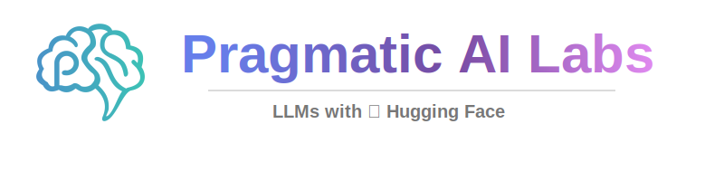

[](https://ds500.paiml.com "Pragmatic AI Labs")

This repository contains hands-on labs for running and building applications with Large Language Models. A Hugging Face course from Pragmatic AI Labs.

# Large Language Models with Hugging Face

In this course, you will learn how to build applications and solutions with Large Language Models using the Hugging Face platform. You'll explore retrieval augmented generation, function calling, and agent development to create powerful AI solutions that can interact with external systems and data.

## Contents

This repository has several examples located in the [./examples](./examples) directory and hands-on labs in the [./labs](./labs) directory. Make sure you have Python installed and you are using [Visual Studio Code](https://code.visualstudio.com/?WT.mc_id=academic-0000-alfredodeza).

This repository is *Codespaces ready*, and it is set as a template repository. You can create a new repository from this template and start working on your own with Codespaces. This means that Python, Copilot, and all the extensions are already installed and configured for you.

[](https://codespaces.new?hide_repo_select=true&ref=main)

## Labs

Complete these hands-on labs to reinforce your learning:

| Lab | Topic | Examples Used |
|-----|-------|---------------|
| [Lab 1: Building a Simple Chat Interface](./labs/lab-1.md) | Connect to LLMs, build chat apps, async operations, structured output | [examples/1-simple](./examples/1-simple/) |
| [Lab 2: Retrieval Augmented Generation (RAG)](./labs/lab-2.md) | Embeddings, vector databases, semantic search, RAG pipelines | [examples/2-rag](./examples/2-rag/) |
| [Lab 3: Building LLM APIs with FastAPI](./labs/lab-3.md) | HTTP APIs, FastAPI endpoints, RAG integration | [examples/3-api](./examples/3-api/) |
| [Lab 4: Working with Small Language Models](./labs/lab-4.md) | Model selection, optimization, benchmarking, model routing | [examples/4-small-lm](./examples/4-small-lm/) |
| [Lab 5: Building Agentic Applications](./labs/lab-5.md) | Function calling, tool use, LangChain agents, Hugging Face Inference | [examples/5-agentic](./examples/5-agentic/) |

## Course Outline

### Lesson 1: Getting Started with LLMs
- [Building a simple chat interface](./examples/1-simple/)
- Prompt engineering patterns
- System prompts and roles
- Async operations for better performance
- Structured output with Pydantic

### Lesson 2: Retrieval Augmented Generation
- [Embeddings with Sentence Transformers](./examples/2-rag/)
- Building and querying vector databases
- Semantic search with Qdrant
- Combining search results with LLM generation

### Lesson 3: Building LLM APIs
- [Python APIs with FastAPI](./examples/3-api/)
- Creating chat endpoints
- Integrating RAG with web services
- Testing and deploying APIs

### Lesson 4: Small Language Models
- [Working with efficient local models](./examples/4-small-lm/)
- Model size tradeoffs
- Benchmarking and optimization
- Intelligent model routing

### Lesson 5: Agentic Applications
- [Function calling and tool use](./examples/5-agentic/)
- Building agents with LangChain
- Using Hugging Face Inference API
- Multi-tool agent development

## Local Setup

If you prefer to work locally instead of using Codespaces:

1. Clone this repository:
   ```bash
   git clone https://github.com/alfredodeza/hf-llms.git
   cd hf-llms
   ```

2. Create a virtual environment:
   ```bash
   python -m venv .venv
   source .venv/bin/activate  # On Windows: .venv\Scripts\activate
   ```

3. Install dependencies:
   ```bash
   pip install openai sentence-transformers qdrant-client pandas fastapi uvicorn langchain langchain-openai
   ```

4. Install Ollama for local LLM inference:
   ```bash
   # Visit https://ollama.ai for installation instructions
   ollama pull qwen2.5-coder:7b-instruct
   ```

5. Open in VS Code:
   ```bash
   code .
   ```

## Resources

- [Hugging Face Documentation](https://huggingface.co/docs)
- [Hugging Face Hub](https://huggingface.co/models)
- [Sentence Transformers](https://www.sbert.net/)
- [Qdrant Vector Database](https://qdrant.tech/documentation/)
- [LangChain Documentation](https://python.langchain.com/)
- [FastAPI Documentation](https://fastapi.tiangolo.com/)

**Coursera Courses**

- [MLOps Machine Learning Operations Specialization](https://www.coursera.org/specializations/mlops-machine-learning-duke)
- [Linux and Bash for Data Engineering](https://www.coursera.org/learn/linux-and-bash-for-data-engineering-duke)
- [Open Source Platforms for MLOps](https://www.coursera.org/learn/open-source-platforms-duke)
- [Python Essentials for MLOps](https://www.coursera.org/learn/python-essentials-mlops-duke)
- [Web Applications and Command-Line tools for Data Engineering](https://www.coursera.org/learn/web-app-command-line-tools-for-data-engineering-duke)
- [Python and Pandas for Data Engineering](https://www.coursera.org/learn/python-and-pandas-for-data-engineering-duke)
- [Scripting with Python and SQL for Data Engineering](https://www.coursera.org/learn/scripting-with-python-sql-for-data-engineering-duke)
