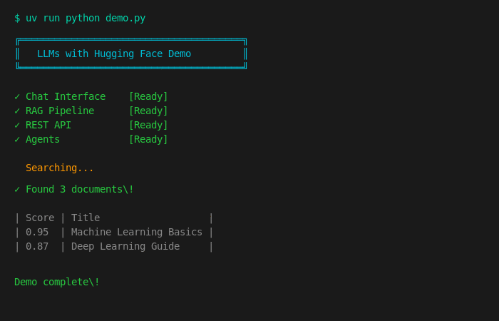

# Large Language Models with Hugging Face

<p align="center">
  <a href="https://ds500.paiml.com" title="Pragmatic AI Labs">
    
  </a>
</p>

[](https://www.python.org/downloads/)
[](#)
[](LICENSE)

<p align="center">
  <strong>Hands-on labs for building LLM applications with Hugging Face</strong><br>
  RAG pipelines | Agentic workflows | FastAPI integration | Local & cloud models
</p>

---

## Quick Start

Get up and running in under 2 minutes:

```bash
# Clone and install
git clone https://github.com/alfredodeza/hf-llms.git && cd hf-llms
uv sync --all-extras

# Start Ollama (in separate terminal)
ollama serve
ollama pull qwen2.5-coder:7b-instruct

# Run the chat example
export MODEL_NAME="qwen2.5-coder:7b-instruct"
export OPENAI_API_BASE="http://localhost:11434/v1"
export OPENAI_API_KEY="ollama"
uv run python examples/1-simple/chat.py
```

**Expected output:**
```
Welcome! how can I help you today?
>> What is Python?
Python is a high-level, interpreted programming language known for its
simplicity and readability...
```

Or use **GitHub Codespaces** for zero-setup:

[](https://codespaces.new?hide_repo_select=true&ref=main)

---

## Usage

### Interactive Demo

Run the visual demo to explore all features:

```bash
uv run python demo.py
```

### Chat with LLMs

```python
from src.models.llm import LLMClient

client = LLMClient()
response = client.chat("What is machine learning?")
print(response)
```

### RAG Pipeline

```python
from src.rag.vectorstore import VectorStore

# Create vector store and add documents
store = VectorStore(collection_name="my_docs")
store.add_documents([
    {"content": "Machine learning is a subset of AI..."},
    {"content": "Python is a programming language..."},
])

# Search for relevant documents
results = store.search("What is ML?", limit=3)
```

### REST API

```bash
# Start the API server
uv run uvicorn src.api.main:app --reload

# Chat endpoint
curl -X POST http://localhost:8000/chat \
  -H "Content-Type: application/json" \
  -d '{"message": "Hello!"}'

# Research with RAG
curl -X POST http://localhost:8000/research \
  -H "Content-Type: application/json" \
  -d '{"query": "Explain neural networks"}'
```

---

## Demo Preview



Run `uv run python demo.py` to see the interactive demo:

```
╔═══════════════════════════════════════════════════════════════╗
║   ██╗     ██╗     ███╗   ███╗███████╗                        ║
║   ██║     ██║     ████╗ ████║██╔════╝   LLMs with            ║
║   ██║     ██║     ██╔████╔██║███████╗   Hugging Face         ║
║   ██║     ██║     ██║╚██╔╝██║╚════██║                        ║
║   ███████╗███████╗██║ ╚═╝ ██║███████║   Research Assistant   ║
║   ╚══════╝╚══════╝╚═╝     ╚═╝╚══════╝                        ║
╚═══════════════════════════════════════════════════════════════╝

┌──────────────────┬──────────────────────────────────┬──────────┐
│ Feature          │ Description                      │ Status   │
├──────────────────┼──────────────────────────────────┼──────────┤
│ Chat Interface   │ OpenAI-compatible chat with LLMs │ ✅       │
│ RAG Pipeline     │ Semantic search + embeddings     │ ✅       │
│ REST API         │ FastAPI at /chat, /research      │ ✅       │
│ Agents           │ LangChain with tool calling      │ ✅       │
└──────────────────┴──────────────────────────────────┴──────────┘

⠋ Encoding query... ✓ Found 3 relevant documents!
```

---

## Features

| Feature | Description | Example |
|---------|-------------|---------|
| **Chat Interface** | OpenAI-compatible chat with local/remote LLMs | `examples/1-simple/` |
| **RAG Pipeline** | Semantic search with Sentence Transformers + Qdrant | `examples/2-rag/` |
| **REST API** | FastAPI endpoints for LLM integration | `examples/3-api/` |
| **Small LMs** | Efficient local models with Ollama | `examples/4-small-lm/` |
| **Agents** | LangChain agents with tool calling | `examples/5-agentic/` |

---

## Labs

Complete hands-on labs to master LLM development:

| Lab | Topic | Time |
|-----|-------|------|
| [Lab 1: Chat Interface](./labs/lab-1.md) | Connect to LLMs, async operations, structured output | 30 min |
| [Lab 2: RAG](./labs/lab-2.md) | Embeddings, vector databases, semantic search | 45 min |
| [Lab 3: APIs](./labs/lab-3.md) | FastAPI endpoints, RAG integration | 30 min |
| [Lab 4: Small LMs](./labs/lab-4.md) | Model selection, optimization, benchmarking | 30 min |
| [Lab 5: Agents](./labs/lab-5.md) | Function calling, LangChain, tool use | 45 min |

### Capstone Project

Build a production-ready **AI Research Assistant** combining all concepts:

```
research-assistant/
├── src/
│   ├── api/          # FastAPI application
│   ├── agents/       # Research agent with tools
│   ├── rag/          # Vector store & retrieval
│   └── models/       # LLM client & schemas
└── tests/            # 59 test cases
```

See [Capstone Project](./docs/capstone-project.md) for full details.

---

## API Demo

Start the Research Assistant API:

```bash
uv run uvicorn src.api.main:app --reload
```

**Endpoints:**

```bash
# Health check
curl http://localhost:8000/health
# {"status": "healthy"}

# Chat
curl -X POST http://localhost:8000/chat \
  -H "Content-Type: application/json" \
  -d '{"message": "What is machine learning?"}'

# Add document to knowledge base
curl -X POST http://localhost:8000/documents \
  -H "Content-Type: application/json" \
  -d '{"title": "ML Basics", "content": "Machine learning is..."}'

# Research with RAG
curl -X POST http://localhost:8000/research \
  -H "Content-Type: application/json" \
  -d '{"query": "Explain machine learning"}'
```

Interactive docs at: http://localhost:8000/docs

---

## Installation

### Option 1: GitHub Codespaces (Recommended)

Click the badge above - everything is pre-configured.

### Option 2: Local Setup

**Prerequisites:**
- Python 3.10+
- [uv](https://docs.astral.sh/uv/) package manager
- [Ollama](https://ollama.ai) for local LLMs

```bash
# Install uv (if needed)
curl -LsSf https://astral.sh/uv/install.sh | sh

# Clone repository
git clone https://github.com/alfredodeza/hf-llms.git
cd hf-llms

# Install dependencies
uv sync --all-extras

# Verify installation
uv run pytest tests/ -v
```

---

## Project Structure

```
llms-with-huggingface/
├── examples/           # Standalone examples for each lesson
│   ├── 1-simple/       # Basic chat interface
│   ├── 2-rag/          # RAG with Qdrant
│   ├── 3-api/          # FastAPI endpoints
│   ├── 4-small-lm/     # Local model config
│   └── 5-agentic/      # LangChain agents
├── labs/               # Hands-on lab instructions
├── src/                # Capstone implementation
│   ├── api/            # FastAPI app with routes
│   ├── agents/         # Research agent + tools
│   ├── rag/            # VectorStore implementation
│   └── models/         # LLMClient + Pydantic schemas
├── tests/              # 59 test cases (API, RAG, security)
└── docs/               # Capstone project guide
```

---

## Configuration

Set environment variables for LLM access:

| Variable | Default | Description |
|----------|---------|-------------|
| `OPENAI_API_KEY` | `ollama` | API key (any value for Ollama) |
| `OPENAI_API_BASE` | `http://localhost:11434/v1` | API endpoint |
| `MODEL_NAME` | `qwen2.5-coder:7b-instruct` | Model to use |

---

## Development

```bash
# Run tests
uv run pytest tests/ -v

# Lint code
uv run ruff check src/ tests/

# Format code
uv run ruff format src/ tests/

# Type check
uv run mypy src/
```

---

## Troubleshooting

<details>
<summary><strong>Ollama Connection Issues</strong></summary>

```bash
# Check if Ollama is running
curl http://localhost:11434/api/tags

# Start Ollama
ollama serve
```
</details>

<details>
<summary><strong>Model Not Found</strong></summary>

```bash
# List available models
ollama list

# Pull required model
ollama pull qwen2.5-coder:7b-instruct
```
</details>

<details>
<summary><strong>Import Errors</strong></summary>

```bash
# Reinstall dependencies
uv sync --all-extras
```
</details>

<details>
<summary><strong>Port 8000 In Use</strong></summary>

```bash
# Find and kill process
lsof -i :8000
kill -9 <PID>

# Or use different port
uv run uvicorn src.api.main:app --port 8001
```
</details>

---

## Resources

**Documentation:**
- [Hugging Face Docs](https://huggingface.co/docs)
- [LangChain Docs](https://python.langchain.com/)
- [FastAPI Docs](https://fastapi.tiangolo.com/)
- [Qdrant Docs](https://qdrant.tech/documentation/)

**Courses:**
- [MLOps Specialization](https://www.coursera.org/specializations/mlops-machine-learning-duke)
- [Python for MLOps](https://www.coursera.org/learn/python-essentials-mlops-duke)

---

## Contributing

1. Fork the repository
2. Create feature branch: `git checkout -b feature/amazing`
3. Run tests: `uv run pytest tests/`
4. Commit changes: `git commit -m 'Add feature'`
5. Push: `git push origin feature/amazing`
6. Open Pull Request

---

## License

Apache License 2.0 - see [LICENSE](LICENSE) for details.

---

<p align="center">
  Made with care by <a href="https://paiml.com">Pragmatic AI Labs</a>
</p>
